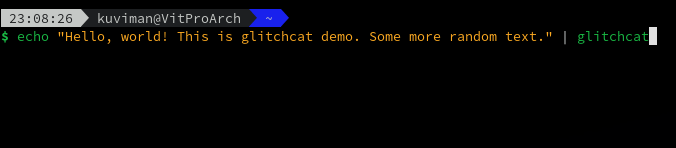

# Glitchcat

[](https://travis-ci.org/kuviman/glitchcat)

`glitchcat` is a cat-like program with glitch animation.



Use can even use it together with [`lolcat`](https://github.com/busyloop/lolcat)


## Install

To install, you will need [Rust compiler](https://rust-lang.org)

Then run:

```sh
cargo install glitchcat
```

To update, run:

```sh
cargo install --force glitchcat
```

## Usage

Example usage:

```sh
echo "Hello, world\!" | glitchcat
```

For more, see

```sh
glitchcat --help
```