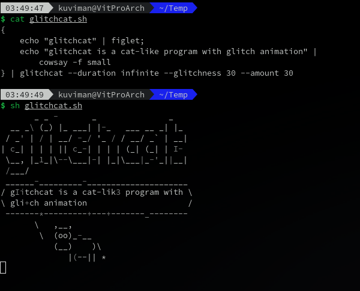
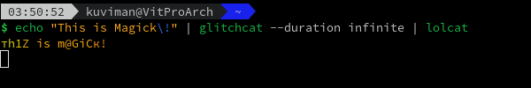

# Glitchcat

[](https://travis-ci.org/kuviman/glitchcat)

`glitchcat` is a cat-like program that creates a glitch-like animation of text.



Use can even use it together with [`lolcat`](https://github.com/busyloop/lolcat)



## Install

To install, run:

```sh
cargo install glitchcat
```

To update, run:

```sh
cargo install --force glitchcat
```

## Usage

Example usage:

```sh
echo "Hello, world! This is glitchcat demo. Some more random text." | glitchcat
```